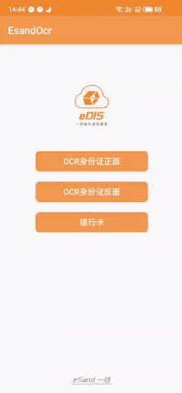

### 概述
Android 证件SDK (身份证，银行卡，驾驶证，行驶证，营业执照等) 如下：




- H5 体验DEMO链接 ： https://dev.esandcloud.com/h5demo/esand/ocr


## 插件的使用
对外提供接口：
```js
/*
 * 执行OCR识别
 * @param options(JSONObject), 包括如下字段：
 *        token：从服务器端获取，只可使用一次
 *        ocrType：ocr 类型，0：身份证正面，1：身份证反面,2:银行卡,666: 不做OCR,只采集照片
 *        from：从哪儿获取数据，0：从摄像头拍摄，1：从相册选择
 * @param callback 执行结果回调，传入参数为对象result，result包括如下几个字段：
 *        code：执行状态码，0000：正常，0001：本地执行异常，0002：服务器端返回异常，0003：用户取消了操作，0004：未授予权限
 *        msg：执行结果描述
 *        requestId：请求ID(用于定位问题)
 *        data：OCR结果（执行成功才有此字段）
 *        image：拍摄/选择的照片（B64编码的字符串）
 * 上述data字段内容如下（json字符串）：
 * 1. 身份证正面
    {
        "front":{
            "name":"李...", -- 姓名
            "gender":"男",  -- 性别
            "nationality":"汉", -- 民族
            "birthDay":"19930504", -- 生日
            "idNumber":"441283.....", -- 身份证号码
            "address":"广东省广州市......", -- 住址
            "portrait":"/9j/4AAQSkZJRgABAQAAAQABAAD/2wBDAQICAgICAg........." -- 截取身份证的照片
        }
    }
 * 2 身份证背面
  {
    "back":{
        "issuedBy":"北京海淀公安局", -- 签发机构
        "validDateStart":"2017.09.26", -- 开始有效日期
        "validDateEnd":"2037.09.26",  -- 失效日期
        "completeness":0 --身份证完整性: 0: 完整 1: 不完整，但关键信息内容区域都在图片内 2: 不完整，且有部分内容在区域外
    }
 }
 * 3 银行卡
 {
    "bankCard":{
        "number":"623058 ************", --银行卡号
        "bank":"平安银行", --银行名称
        "organization":"UNIONPAY" --银行类型
    }
}
 */

esandOcrModule.processOcr(options, callback);
```

## 其他信息
1. 完整接入文档：[https://esandinfo.yuque.com/books/share/80f28828-9ab9-45f4-a73d-b10dc6f91083?#](https://esandinfo.yuque.com/books/share/80f28828-9ab9-45f4-a73d-b10dc6f91083?# )
2. 服务器端协议文档：[https://market.aliyun.com/products/57000002/cmapi00042834.html](https://market.aliyun.com/products/57000002/cmapi00042834.html)
3. 后端管理控制台地址: [http://openali.esandcloud.com](http://openali.esandcloud.com)

### 联系我
---
有任何问题或疑问可联系我

<b>瑞德</b>


`Wechat Number:` esand_info </br>
`QQ Number:` 3626921591 </br>
`Phone Number:` +8613691664797</br>
`Email:` reid.li@foxmail.com</br>
`Telegram:` [@R90000000](https://t.me/R90000000)</br>


Wechat QR CODE :


